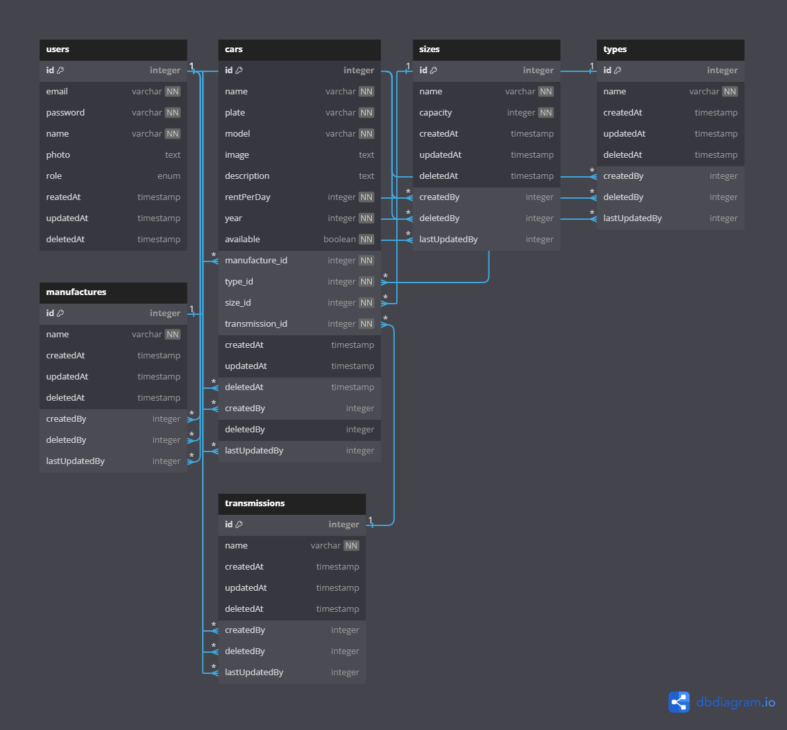

## Car Management API

Challenge Chapter 5 - Binar Academy

## ERDiagram



## Tech Stack
- [Google Cloud Platform](https://cloud.google.com)
- [Express.js](https://expressjs.com)
- [Sequelize](https://sequelize.org/)
- [Redis](https://redis.io/docs/)
- [PostgreSQL](https://www.postgresql.org/)
- [Cloudinary](https://cloudinary.com/)
- [Flowbite](https://flowbite.com/)

## Installation

#### 1. Clone Repository

```
git clone https://github.com/perriee/24001085-km6-fer-CarManagementAPI-ch5.git
```

#### 2. Install Dependencies

```
npm install
```

#### 3. Copy .env.example file

```
cp .env.example .env
```

#### 4. Start Server

```
npm run dev
```

#### 5. Access Port

by default server running in `localhost:3000`

## Superadmin Account
- email: superadmin@gmail.com
- pass: superadmin123

## API Reference

### Documentation
https://documenter.getpostman.com/view/27037203/2sA3BoZX4j

### User Endpoints
superadmin, admin, and user login using the same endpoint, but differentiated based on their role

| Route           | Method   | Description      |
| --------------- | -------- | ---------------- |
| `/api/auth/register`     | `POST`    | User register     |
| `/api/auth/login`     | `POST`   | User login       |
| `/api/auth/profile` | `GET`    | Get profile current user login    |

### Admin Endpoints
only user with role "superadmin" can make admin

| Route           | Method   | Description      |
| --------------- | -------- | ---------------- |
| `/api/auth/admin`     | `POST`    | Create admin     |


### Car Endpoints

| Route           | Method   | Description      |
| --------------- | -------- | ---------------- |
| `/api/cars`     | `GET`    | Get all cars     |
| `/api/cars`     | `POST`   | Create car       |
| `/api/cars/:id` | `GET`    | Get car by ID    |
| `/api/cars/:id` | `PUT`    | Update car by ID |
| `/api/cars/:id` | `DELETE` | Delete car by ID |

### Manufacture Endpoints

| Route                   | Method   | Description              |
| ----------------------- | -------- | ------------------------ |
| `/api/manufactures`     | `GET`    | Get all manufactures     |
| `/api/manufactures`     | `POST`   | Create manufacture       |
| `/api/manufactures/:id` | `GET`    | Get manufacture by ID    |
| `/api/manufactures/:id` | `PUT`    | Update manufacture by ID |
| `/api/manufactures/:id` | `DELETE` | Delete manufacture by ID |

### Type Endpoints

| Route            | Method   | Description       |
| ---------------- | -------- | ----------------- |
| `/api/types`     | `GET`    | Get all types     |
| `/api/types`     | `POST`   | Create type       |
| `/api/types/:id` | `GET`    | Get type by ID    |
| `/api/types/:id` | `PUT`    | Update type by ID |
| `/api/types/:id` | `DELETE` | Delete type by ID |

### Size Endpoints

| Route            | Method   | Description       |
| ---------------- | -------- | ----------------- |
| `/api/sizes`     | `GET`    | Get all sizes     |
| `/api/sizes`     | `POST`   | Create size       |
| `/api/sizes/:id` | `GET`    | Get size by ID    |
| `/api/sizes/:id` | `PUT`    | Update size by ID |
| `/api/sizes/:id` | `DELETE` | Delete size by ID |

### Transmission Endpoints

| Route                    | Method   | Description               |
| ------------------------ | -------- | ------------------------- |
| `/api/transmissions`     | `GET`    | Get all transmissions     |
| `/api/transmissions`     | `POST`   | Create transmission       |
| `/api/transmissions/:id` | `GET`    | Get transmission by ID    |
| `/api/transmissions/:id` | `PUT`    | Update transmission by ID |
| `/api/transmissions/:id` | `DELETE` | Delete transmission by ID |
